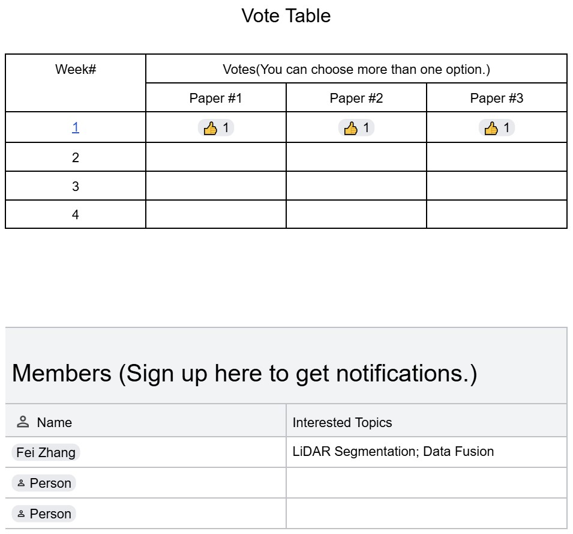
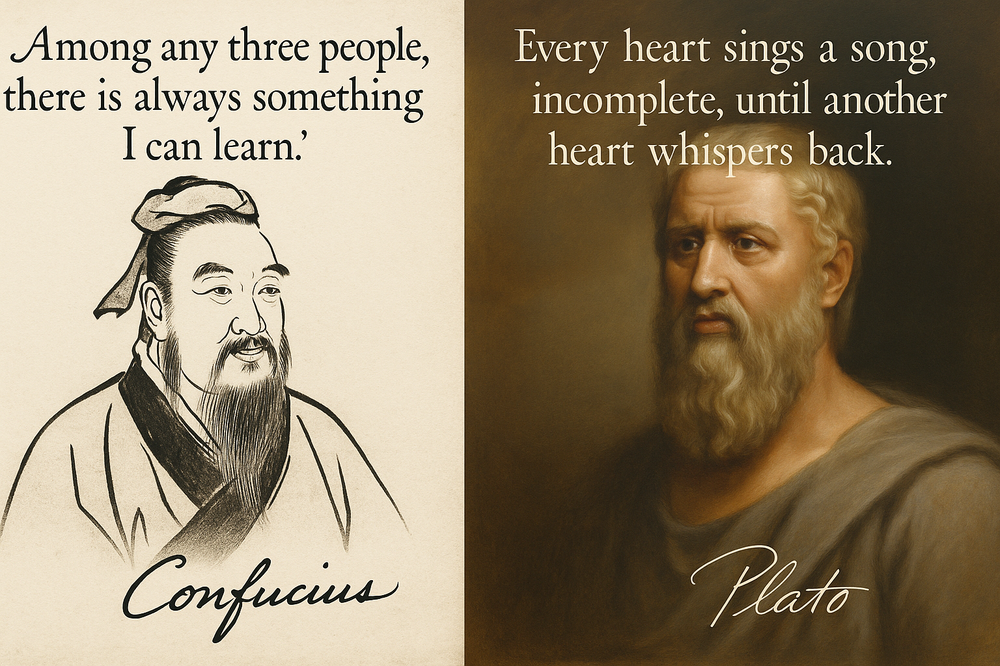

# 🎓🤓📚 λ-Geeks' Time 📚🤓🎓

*A weekly paper discussion forum for LiDAR, Remote Sensing, and Multimodal Sensing Research*

Welcome to **λ-Geeks' Time**! This repository hosts materials and logistics for our weekly group paper discussions. The symbol **λ (lambda)** stands for *spectrum*, reflecting the broad yet interconnected themes we explore—from LiDAR and multispectral imaging to advanced AI techniques and geospatial analysis.

---

## Weekly Paper Discussion

Each week, we come together to discuss a paper related to LiDAR, remote sensing, or multimodal sensing. These sessions are designed to deepen our understanding of cutting-edge research and explore how it connects to our own work.

Our goals are to:

* **Learn with ambition**: Stay informed on the latest breakthroughs in LiDAR, remote sensing, and AI
* **Learn efficiently**: Share insights, save time, and grow together
* **Learn with fun**: Make paper reading a lively, idea-driven group experience

Interested in joining? Sign up here:
👉 [**λ-Geeks' Time Sign-Up**](https://docs.google.com/document/d/1qtEVUmaqrHbyZwN6tZVJzuS0EeOU4mtVxyJrCBGTMvU/edit?tab=t.mds9qz7e29is#bookmark=id.msxv37lwb7ma)

Whether you're an undergraduate, graduate student, or postdoc — all are welcome!
Feel free to bring your own ideas and paper suggestions. While we encourage regular participation, you're always welcome to drop in for topics that interest you.

---

### Paper Proposals

Browse our active proposals in [this doc](https://docs.google.com/document/d/1qtEVUmaqrHbyZwN6tZVJzuS0EeOU4mtVxyJrCBGTMvU/edit?tab=t.0).
Have a suggestion? Feel free to add it to the “pool” tab!

### 🗓️ Schedule

* **📄 Paper Proposals**:
  Three paper options are shared the week prior via Slack and Email.

* **🗳️ Vote for the Paper(s) to Discuss**:
  Cast your vote [**here**](https://docs.google.com/document/d/1qtEVUmaqrHbyZwN6tZVJzuS0EeOU4mtVxyJrCBGTMvU/edit?tab=t.mds9qz7e29is).
  👍 Click week number to skim the papers; then click the thumbs-up icon(s) below your choice(s). Sign up in the table below if you haven't.  
  **Voting deadline: Mondays at 6:00 PM**

  

* **🕒 Discussion Time**:
  Will be set based on group availability.
  [**Vote here**](https://www.when2meet.com/?30671185-vrTcK): no registration required—just enter your name and drag to highlight your available time slots (Wed/Thu/Fri, mornings or afternoons).
  **Voting deadline: Friday, 05/23/2025, at 9:00 AM**

### Topics

* **LiDAR Point Cloud Processing**

  * Registration
  * Segmentation
  * Multimodal Fusion (e.g., LiDAR + RGB / Multispectral / Hyperspectral)
* **Sensor Alignment & Calibration**
* **AI for Remote Sensing**
* ... and more!

### Format

Each session includes a presenter-prepared outline that covers:

* **When & Where**: Publication date, journal/conference venue
* **Who**: Background of key authors
* **What**: Main contributions and innovations
* **Why**: Relevance to our research
* **How**: Reproducibility details

  * GitHub links or supplementary material
  * Programming language & dependencies
  * Hardware requirements (e.g., GPU, sensors)

All slides and outlines will be uploaded to the `resources/` folder.

### Contact

For questions or suggestions, reach out to **Fei Zhang** on Slack or by email.

