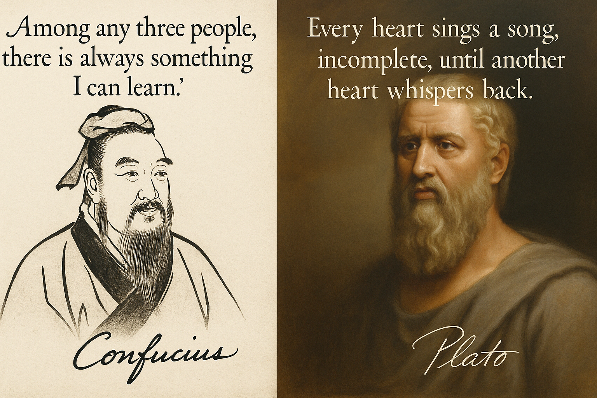

# 🤓📚 λ-Geeks' Time 📚🤓

*A weekly paper discussion forum for LiDAR, Remote Sensing, and Multimodal Sensing Research*  

Welcome to **λ-Geeks' Time**! This repository hosts the materials and logistics for our weekly group paper discussions. The symbol **λ** (lambda)—representing *spectrum*—reflects the wide range of interconnected topics we explore: from **LiDAR** and **multispectral imaging** to **advanced AI techniques** and **geospatial analysis**.

Each week, we come together to dive into a research paper related to above topics. These sessions help us sharpen our understanding of cutting-edge work and explore its relevance to our own research.

Our Goals:

* **Stay sharp and curious** – Track breakthroughs in LiDAR, AI, and sensing systems to stay on the cutting edge.
* **Build collective insight** – Share perspectives and strategies to accelerate understanding and problem-solving.
* **Explore with purpose** – Connect research to real-world applications and our own projects.

Whether you're an undergraduate, graduate student, or postdoc, you're warmly welcome here. Bring your curiosity, your questions, and your own paper suggestions! While we encourage regular participation, feel free to join whenever a topic sparks your interest.

Let’s challenge ourselves, expand our vision, and grow—together.

## How to Take Part

- Step 1: Read the Paper Ahead  
After each session, the paper for next sesssion will be sent by email. Please read it ahead—whether just skimming or diving in thoroughly. Give it at least as much time as a medium Starbucks coffee ☕ — it’ll help make our discussion more engaging.

- Step 2: Join the Discussion - **Fridays, 11:00 - 12:00 AM**.  
🕒 [Time Until Next Session](https://virsa-lab.github.io/lambda-geeks-time) 🕒  
💬 Questions and discussion are highly encouraged at any time during the session.

- [Optional] Step 3: Propose Your Interested Paper [**Here**](https://docs.google.com/document/d/1qtEVUmaqrHbyZwN6tZVJzuS0EeOU4mtVxyJrCBGTMvU/edit?tab=t.auiq8w9dmakr)

---

## Topics

* **LiDAR Point Cloud**

  * Registration
  * Segmentation
  * Multimodal Fusion (e.g., LiDAR + RGB / Multispectral / Hyperspectral)
* **Sensor Alignment & Calibration**
* **AI for Remote Sensing**
* **Transformer**
* ... and more!

## Format

In each session, we’ll break down the paper and discuss:

* **When & Where** – Publication date and journal/conference venue
* **Who** – Background of key authors
* **What** – Main contributions and innovations
* **Why** – Relevance to our own research
* **How** – Reproducibility details, including:

  * GitHub links or supplementary materials
  * Programming language and dependencies
  * Hardware requirements (e.g., GPU, sensors)

📝 All notes will be updated in [**this document**](https://docs.google.com/document/d/1qtEVUmaqrHbyZwN6tZVJzuS0EeOU4mtVxyJrCBGTMvU/edit?tab=t.0).

## Contact

For questions or suggestions, reach out to **Fei Zhang** on Slack or by email.

