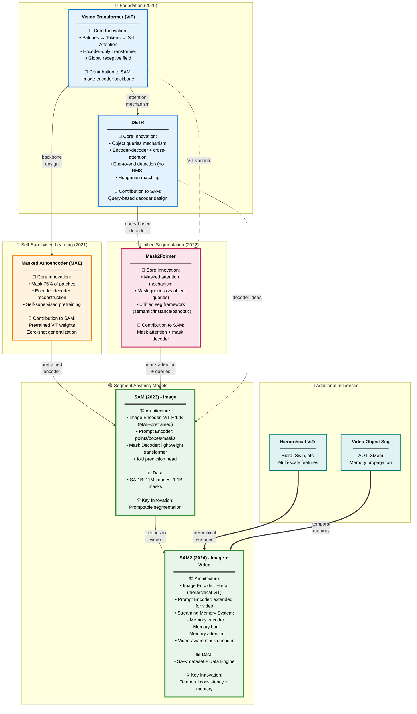
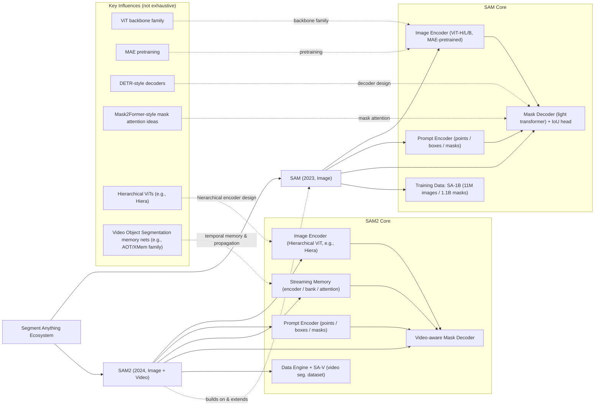

```nginx
DETR → Mask2Former → SAM → SAM2
 ↑          ↑          ↑      ↑
 VIT ← MAE ─┘          │      │

```

---

## 🧩 1. Vision Transformer (ViT, 2020)

**Paper:** “An Image is Worth 16x16 Words: Transformers for Image Recognition at Scale” (Dosovitskiy et al.)

### What it introduced

ViT takes the *Transformer* from NLP (originally for language) and applies it to images by:

1. Splitting an image into small **patches** (e.g., 16×16 pixels),
2. Flattening each patch → linear embedding,
3. Adding **positional encoding**, and
4. Feeding the sequence to a **Transformer encoder** (multi-head self-attention + feed-forward).

### Key modules

* **Patch embedding layer** – converts image patches to tokens.
* **Transformer encoder block** – repeated stack of:

  * Multi-Head Self-Attention (MHA)
  * MLP (feed-forward)
  * LayerNorm + residuals
* **Class token / output head** – for classification tasks.

### Why it matters for SAM

SAM and SAM2 both use **ViT backbones** as *image encoders*.
Their “image encoder” is basically a ViT (sometimes hierarchical or MAE-pretrained).
Understanding attention → how global context is learned → helps you see how segmentation boundaries are refined.

---

## 🧠 2. Masked Autoencoder (MAE, 2021)

**Paper:** “Masked Autoencoders Are Scalable Vision Learners” (He et al.)

### What it introduced

Self-supervised **pretraining** for ViTs by masking out 75 % of image patches and training the model to reconstruct missing ones.

### Key modules

* **Encoder (ViT)** – processes *visible* patches only.
* **Decoder (small ViT)** – reconstructs full image from visible tokens + mask tokens.
* **Loss:** MSE between reconstructed and original image pixels.

### Why it matters for SAM

* SAM’s image encoder (ViT-H/L/B) is **MAE-pretrained**, meaning it learned rich representations *without labels*.
* This pretraining enables strong *zero-shot generalization* — crucial for SAM’s “segment anything” goal.

### So, to “understand MAE,” you need:

1. ViT basics (patches, attention blocks),
2. Encoder–decoder structure,
3. Masking strategy (visible vs masked patches),
4. Reconstruction loss.

---

## 🧰 3. DETR (2020)

**Paper:** “End-to-End Object Detection with Transformers” (Carion et al.)

### What it introduced

Transformers for **object detection**, replacing hand-crafted components (anchors, NMS) with:

* **Encoder–decoder architecture**,
* **Object queries** representing each potential object,
* **Hungarian matching** for one-to-one prediction.

### Key modules

* **Encoder:** processes image features (often from CNN or ViT).
* **Decoder:** takes *object queries* and performs cross-attention to encoder features.
* **Feed-forward heads:** predict class + bounding box for each query.
* **Loss:** bipartite matching between predictions and ground truth.

### Why it matters for SAM

* SAM’s **mask decoder** is DETR-style: it uses **queries** (e.g., point or box prompts) and **cross-attention** with image embeddings to output masks.
* The logic of “prompt as query → attention to features → output structured object” comes from DETR.

---

## 🎭 4. Mask2Former (2022)

**Paper:** “Mask2Former: Masked-Attention Mask Transformer for Universal Image Segmentation” (Cheng et al.)

### What it introduced

A unified framework for **semantic**, **instance**, and **panoptic** segmentation using mask queries.

### Key modules

* **Pixel decoder:** upsamples backbone features (like FPN).
* **Transformer decoder:** uses *mask embeddings* (queries) that attend to pixel features.
* **Masked attention:** attention restricted to predicted mask regions (improves efficiency).
* **Multi-task heads:** each query outputs a mask + class.

### Why it matters for SAM

* SAM’s mask decoder borrows this **masked attention** mechanism.
* The idea of predicting *mask embeddings* directly from prompt queries inspired SAM’s simple but fast mask decoder.
* When you read SAM’s paper, the “lightweight transformer mask decoder” and IoU head are simplified descendants of Mask2Former’s decoder.

---

## 🪜 5. SAM and SAM2

Now you can trace how these modules evolve:

| Concept                               | Origin           | Used in                 |
| ------------------------------------- | ---------------- | ----------------------- |
| Patch tokenization & self-attention   | ViT              | SAM, SAM2               |
| Self-supervised masked reconstruction | MAE              | SAM, SAM2 (pretraining) |
| Query–decoder structure               | DETR             | SAM, SAM2               |
| Mask attention & mask queries         | Mask2Former      | SAM, SAM2               |
| Prompt encoder (points/boxes/masks)   | SAM (new)        | SAM2                    |
| Memory attention / propagation        | AOT/XMem (video) | SAM2                    |

---

## 🧭 Suggested learning path for your paper club

Here’s how you can study it progressively:

| Week | Topic                      | Core idea to grasp                    | Recommended short paper                            |
| ---- | -------------------------- | ------------------------------------- | -------------------------------------------------- |
| 1    | Transformer (NLP → Vision) | Self-attention mechanics              | “Attention Is All You Need”                        |
| 2    | ViT                        | Patches → tokens → attention          | “An Image Is Worth 16x16 Words”                    |
| 3    | MAE                        | Masked pretraining                    | “Masked Autoencoders Are Scalable Vision Learners” |
| 4    | DETR                       | Object queries & matching             | “End-to-End Object Detection with Transformers”    |
| 5    | Mask2Former                | Mask attention & unified segmentation | “Mask2Former: Masked-Attention Mask Transformer”   |
| 6    | SAM & SAM2                 | Promptable & temporal segmentation    | “Segment Anything in Images and Videos”            |





[figma:SAM_and_SAM2_module_tree](https://www.figma.com/board/kB6W21Ivemfy9ZS728DO7g/SAM-vs-SAM2-Module-Tree?node-id=0-1&p=f&t=LLZb0IgmVOXV165h-0)

| Model           | Paper title / link                                                                             | Notes                                                                                                                                                                       |
| --------------- | ---------------------------------------------------------------------------------------------- | --------------------------------------------------------------------------------------------------------------------------------------------------------------------------- |
| **ViT**         | *“An Image is Worth 16×16 Words: Transformers for Image Recognition at Scale”* — arXiv / PDF   | [arXiv 2010.11929 / PDF](https://arXiv.org/abs/2010.11929) ([Hugging Face][1])                                                                                              |
| **MAE**         | *“Masked Autoencoders Are Scalable Vision Learners”* — arXiv / PDF                             | [arXiv 2111.06377](https://arXiv.org/abs/2111.06377) ([Reddit][2])                                                                                                          |
| **DETR**        | *“End-to-End Object Detection with Transformers”* — arXiv / PDF                                | [arXiv 2005.12872](https://arXiv.org/abs/2005.12872)                                                                                                                        |
| **Mask2Former** | *“Masked-attention Mask Transformer for Universal Image Segmentation”* — arXiv / PDF          | [arXiv 2112.01527](https://arxiv.org/abs/2112.01527)                                                                                                                        |

[1]: https://huggingface.co/papers/2010.11929?utm_source=chatgpt.com "Paper page - An Image is Worth 16x16 Words: Transformers for Image Recognition at Scale"
[2]: https://www.reddit.com/r/MachineLearning/comments/qt4y6g?utm_source=chatgpt.com "[D] (Paper Overview) MAE: Masked Autoencoders Are Scalable Vision Learners"